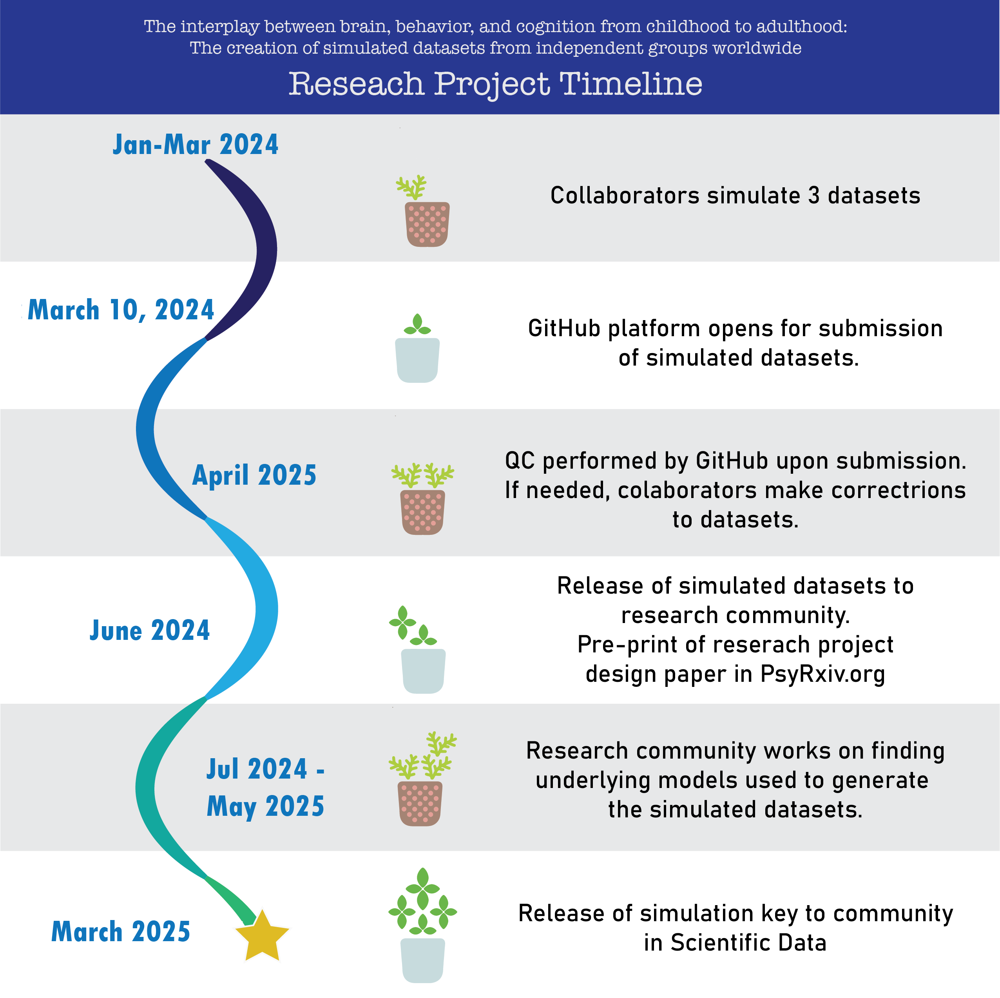

#### Quick links:
&emsp; [Project summary](pages/full_abstract.html) \
&emsp; [Description of measures and data dictionary](pages/measures.html) \
&emsp; [Data submission tutorial](pages/tutorial.html) \
&emsp; [Ready to submit?](#ready)

---
<p align="center">
    
</p>

---
{: id="ready"}
To submit your simulated data files, you will need to:
1. Fork [our repository](https://github.com/SoCoDeN/Simulation)
2. Create a branch with the same name as your site ID
3. Commit you data files to `data/<site_id_/`
4. Push your your data files to your remote repository
5. Create a pull request into our repository

The pull request will automatically run a script that ensures your data files are ready for submission. \
Please see our [data dictionary](pages/measures.html) for information about the measures and quality checking criteria
and see our [data submission tutorial](pages/tutorial.html) for a complete walkthrough of how to submit your data.

Data files should be named: `<site_id>_data*.csv`, where `site_id` is your site ID and `*` is an integer.
For example, if your site ID is `nimh` and you are submitting 3 data files, your tree should look like:
```
Simulation/
    data/
        nimh/
            nimh_data1.csv
            nimh_data2.csv
            nimh_data3.csv
```

#### Are you ready to submit your data?
- [x] &ensp; My branch name is the same as my `Site_ID`
- [x] &ensp; All data files are named `<site_ID>_data*.csv`
- [x] &ensp; All columns are present in my data file(s)
- [x] &ensp; All columns are named properly
- [x] &ensp; Data are coded according to the [data dictionary](pages/measures.html)
- [x] &ensp; All measures are within the appropriate scales and distribution
{: style='list-style-type: none'}

---
### [Create Pull Request](https://github.com/SoCoDeN/Simulation/pulls)

Once you create the pull request, we will automatically check your data files. \
If the test fails, you can see the output:
1. Click `Details` next to the failed job
2. Click `Run script` to view the output of the QC checks

**If the QC script fails**, we will work with you until your data pass all QC criteria.
To fix any issues that arise:
1. Correct the data files on your local copy of your forked repo
2. Commit your changes
3. Push your local repo to your remote fork

This pull request will automatically update when your forked repo changes.

_Your changes must be on the same branch as the one you used to create this pull request._

---
<p align="right">
    
</p>
