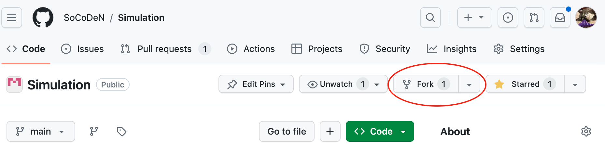
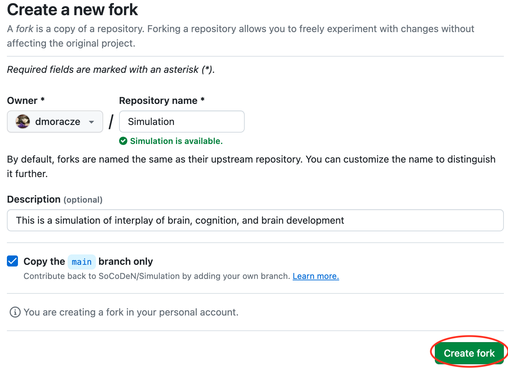
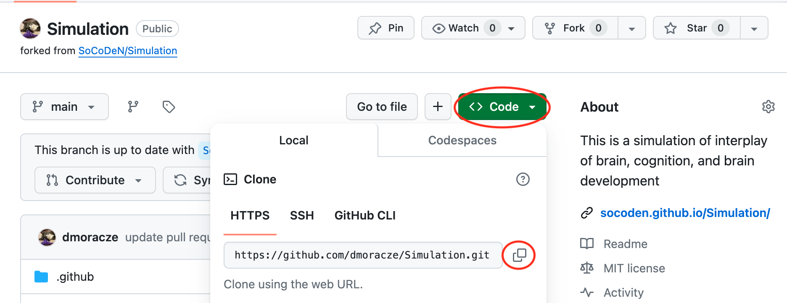
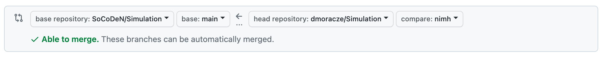

### Prerequisites
To submit data for this project, you must:
- have [git](https://git-scm.com/downloads) installed on your local computer
- have a [GitHub](https://github.com/) account

---
### 1. Fork our repository
- Navigate to the [source code](https://github.com/SoCoDeN/Simulation) for this repository
- Fork the repository into your own account:
<p align="center">
    
</p>
- You can leave the defaults unless you want to change them
- When you are ready, click `Create Fork`
<p align="center">
    
</p>

---
### 2. Clone your repository on your local computer
- Navigate to your copy of the Simulation repository on GitHub
- Click the `Code` button to drop down the code options
- Copy the URL of your repository (or click the `copy` icon)
<p align="center">
    
</p>
- Open a Terminal
- In the terminal, navigate to the directory where you would like to clone the Simulation repository
- Clone the repository using `git clone`
```
cd /path/to/repository
git clone <url> # paste the repository URL here
```
You should see the following output:
```
Cloning into 'Simulation'...
remote: Enumerating objects: 151, done.
remote: Counting objects: 100% (151/151), done.
remote: Compressing objects: 100% (111/111), done.
remote: Total 151 (delta 38), reused 134 (delta 24), pack-reused 0
Receiving objects: 100% (151/151), 662.95 KiB | 5.10 MiB/s, done.
Resolving deltas: 100% (38/38), done.
```

---
### 3. Create a branch and add your data
- Navigate to the Simulation repository
```
cd Simulation
```
- Create a branch called your site ID. For example, if your site is named nimh:
```
git checkout -b nimh
```
You should see the following output:
```
Switched to a new branch 'nimh'
```
- Create your site's data directory. For example, if your site is named nimh:
```
mkdir -p data/nimh
```
- Copy your CSV data files into your site's data directory. \
When complete, your data directory tree should look like:
```
data
└── nimh
    ├── nimh_data1.csv
    ├── nimh_data2.csv
    └── nimh_data3.csv
```
**Note:** You do not need to submit all 3 data files at the same time
- Add your data to the staging area. For example, if your site is named nimh:
```
git add data/nimh/*.csv
```
- Commit your data files. For example, if your site is named nimh:
```
git commit -m 'add nimh data'
```
For our example site, you should see the following output:
```
 3 files changed, 0 insertions(+), 0 deletions(-)
 create mode 100644 data/nimh/nimh_data1.csv
 create mode 100644 data/nimh/nimh_data2.csv
 create mode 100644 data/nimh/nimh_data3.csv
```
- Push your local repository to remote. For example, if your site is named nimh:
```
git push origin nimh
```
For our example site (and for user dmoracze, who is writing this tutorial), you should see the following output:
```
Enumerating objects: 6, done.
Counting objects: 100% (6/6), done.
Delta compression using up to 16 threads
Compressing objects: 100% (3/3), done.
Writing objects: 100% (5/5), 359 bytes | 359.00 KiB/s, done.
Total 5 (delta 1), reused 0 (delta 0), pack-reused 0
remote: Resolving deltas: 100% (1/1), completed with 1 local object.
remote:
remote: Create a pull request for 'nimh' on GitHub by visiting:
remote:      https://github.com/dmoracze/Simulation/pull/new/nimh
remote:
To https://github.com/dmoracze/Simulation.git
 [new branch]      nimh -> nimh
```

---
### 4. Create pull request
- Navigate to the main Simulation repository's pull requests and click `New pull request`
<p align="center">
    
</p>
- Click `compare across forks` to find your branch
<p align="center">
    
</p>
- Select that you want to merge the branch you created into the Simulation repository's main branch. \
For our example site (and for user dmoracze):
<p align="center">
    
</p>
- Click `Create pull request`
- Fill out the prompts in the `Add description box`
- Click `Create pull request`

The creation of the pull request will trigger a quality control script that will ensure that your data files meet the criteria outlined in the [data dictionary](measures.html). If the script fails, then we will respond with what the errors are and how to fix them.

---
### What to do if the QC script fails
We will work with you to iteratively correct the errors in your data files until they pass our QC script.

To see the output of the QC script, which includes a summary of your data files and a complete list of any errors:
- Click `Details` next to the failed job
- Click `Run script` to view the output of the QC checks

To fix any issues that arise:
- Correct the data files on your local copy of your forked repo
- Add your updated data files to the staging area. For example, if your site is named nimh:
```
git add data/nimh/*.csv
```
- Commit your changes with a message about what you fixed
```
git commit -m 'fix dob format'
```
- Push your local repo to your remote fork. For example, if your site is named nimh:
```
git push origin nimh
``` 

Your pull request will automatically update when your forked repo changes and the QC script will re-run.

_Your changes must be on the same branch as the one you used to create this pull request._

[Back](../index.html)

---
